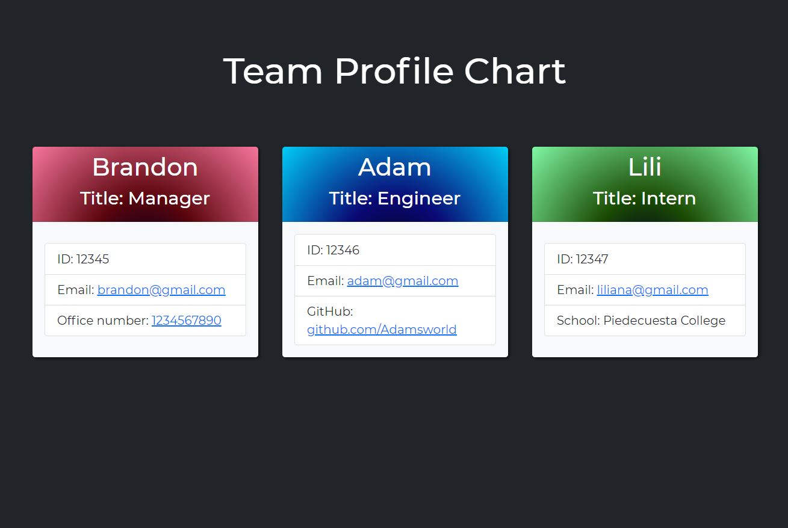

# 10 Object-Oriented Programming: Team Profile Generator

This week our project is a Team Profile Generator, which allows a user to create a visual database of all employees at a company. The program is accessed through the terminal, and will require the installation of Inquirer and Jest. As an overall structure, you will need to build test sheets for all classes, "cards" for each of the employee classes, as well as "Employee" itself, and the installation of two dependencies, mentioned above.

## Walkthrough video:

https://drive.google.com/file/d/1d5s9KeJG5LNPfCwwnQEPs0tXZcDm0i1Q/view


## User Story

```md
AS A manager or owner
I WANT to generate a webpage that displays my team's basic info
SO THAT I have quick access to their emails and GitHub profiles
```


## Output

The following image shows what a user could expect to see after successfully running the program:



## Running the Program

Users can begin to input employee information using the following code:
```bash
node index.js
```
Users can can then execute the test suites using the following code:
```bash
npm test
```

## Reflections on the Project

The most challenging part of this assignment was learning more about TDD, and the ways in which you can structure tests. It will force the user to have a plan for where they want their code to go, and the tests can actually be a way to guide your eventual JS and HTML will look. 

